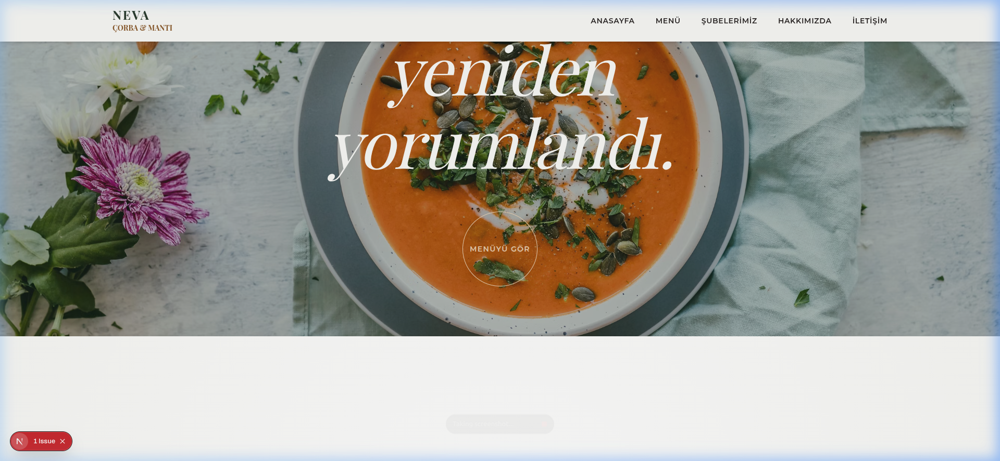

#  Neva Çorba & Mantı

Modern dokunuşlarla harmanlanmış, geleneksel bir lezzet deneyimi sunan **Neva Çorba & Mantı** web sitesi projesi. Bu çalışma, premium bir restoran deneyimini dijital dünyaya taşımayı hedefleyen, yüksek performanslı ve animasyon odaklı bir Next.js uygulamasıdır.



---

## ✨ Özellikler

- 🚀 **Next.js 16 (App Router)** - En güncel React ekosistemi ile hızlı ve SEO dostu yapı.
- 🎨 **Tailwind CSS 4** - Modern ve özelleştirilebilir tasarım sistemi.
- 🎭 **GSAP & Framer Motion** - Göz alıcı ve akıcı arayüz animasyonları.
- 🖱️ **Lenis Smooth Scroll** - Premium bir kaydırma deneyimi.
- 🎡 **3D Review Wheel** - Swiper.js ile güçlendirilmiş, etkileşimli müşteri yorumları çarkı.
- 📱 **Tam Responsive** - Tüm cihazlarda (Mobil, Tablet, Masaüstü) kusursuz görünüm.

---

## 🛠️ Teknoloji Yığını

- **Frontend:** [Next.js](https://nextjs.org/), [React](https://reactjs.org/)
- **Stil:** [Tailwind CSS](https://tailwindcss.com/)
- **Animasyon:** [GSAP](https://greensock.com/gsap/), [Lenis](https://lenis.darkroom.engineering/)
- **Bileşenler:** [Lucide React](https://lucide.dev/), [Swiper.js](https://swiperjs.com/)

---

## 🚦 Başlangıç

Projeyi yerel makinenizde çalıştırmak için aşağıdaki adımları izleyebilirsiniz.

### 🔍 Ön Koşullar

- **Node.js** (v18.x veya üzeri önerilir)
- **npm** veya **yarn**

### 📥 Kurulum

1. Depoyu zip olarak indirin ve dışarı çıkarın (veya `git clone` yapın).
2. Proje dizinine gidin:
   ```bash
   cd NEVA
   ```
3. Gerekli bağımlılıkları yükleyin:
   ```bash
   npm install
   ```

### 🚀 Geliştirme Modunda Çalıştırma

Yerel sunucuyu başlatmak için:
```bash
npm run dev
```

Ardından tarayıcınızda [http://localhost:3000](http://localhost:3000) adresine giderek projeyi görüntüleyebilirsiniz.

---

## 📂 Dosya Yapısı

- `app/` - Sayfa yönlendirmeleri ve ana uygulama mantığı.
- `components/` - Yeniden kullanılabilir UI bileşenleri.
- `public/` - Statik varlıklar (resimler, ikonlar vb.).
- `styles/` - Global CSS ve Tailwind konfigürasyonları.

---

## 📄 Lisans

Bu proje bir portfolyo çalışması olarak hazırlanmıştır. Tüm hakları saklıdır.

---

> **Neva Çorba & Mantı** - *Gelenekten Geleceğe Lezzet.*
